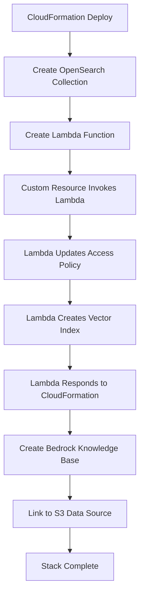

# Bedrock Knowledge Base Custom Resource - Code Explanation

## 1. oss_handler.py (Main Lambda Handler)

### Purpose
This is the **entry point** for the CloudFormation custom resource. It handles the lifecycle events that CloudFormation sends.

### Key Functions

#### `lambda_handler(event, context)`
- **Entry point** called by CloudFormation
- Routes to appropriate handler based on `RequestType`
- Handles CloudFormation response

```python
if request_type == "Create":
    response = on_create(event)      # Initial deployment
elif request_type == "Update":
    response = on_update(event)      # Stack updates
elif request_type == "Delete":
    response = on_delete(event)      # Stack deletion
```

#### `on_create(event)`
**What it does during stack creation:**
1. **Updates access policy** to include the Lambda's execution role
2. **Creates the OpenSearch index** with proper vector mappings
3. **Returns success** to CloudFormation

**Why this is critical:**
- OpenSearch collection exists but is empty
- Bedrock needs a specific index structure to store vectors
- Without this, Bedrock can't function

#### `on_update(event)`
**What it does during stack updates:**
1. **Compares old vs new properties**
2. **Deletes old index** if properties changed
3. **Creates new index** with updated configuration
4. **Handles rollback** if something fails

#### `on_delete(event)`
**What it does during stack deletion:**
1. **Removes the index** from OpenSearch
2. **Ensures clean cleanup**
3. **Never fails** (graceful deletion)

## 2. oss_utils.py (OpenSearch Utilities)

### MODEL_ID_TO_INDEX_REQUEST_MAP
This is the **core configuration** that defines how vectors are stored for each embedding model.

```python
"amazon.titan-embed-text-v2:0": {
    "settings": {
        "index": {
            "knn": True,                    # Enable k-nearest neighbor search
            "knn.algo_param.ef_search": 512 # Search performance parameter
        }
    },
    "mappings": {
        "properties": {
            "bedrock-knowledge-base-default-vector": {
                "type": "knn_vector",
                "dimension": 1024,          # Vector size for Titan v2
                "method": {
                    "name": "hnsw",         # Hierarchical Navigable Small World
                    "engine": "faiss",      # Facebook AI Similarity Search
                    "parameters": {
                        "ef_construction": 512,
                        "m": 16
                    },
                    "space_type": "l2"      # L2 distance for similarity
                }
            },
            "AMAZON_BEDROCK_METADATA": {
                "type": "text",
                "index": "false"            # Metadata not searchable
            },
            "AMAZON_BEDROCK_TEXT_CHUNK": {
                "type": "text",
                "index": "true"             # Text content is searchable
            }
        }
    }
}
```

**Why each model needs different configuration:**
- **Titan v1**: 1536 dimensions
- **Titan v2**: 1024 dimensions  
- **Cohere**: 1024 dimensions
- **Different dimensions** = different index structure

### Key Utility Functions

#### `create_index_with_retries()`
**Why retries are needed:**
- OpenSearch collection might not be immediately ready
- Network issues can cause temporary failures
- **Retries ensure reliability**

#### `update_access_policy_with_caller_arn()`
**Why this is essential:**
- Lambda needs permission to create indexes
- Access policy initially only includes Bedrock service role
- **Adds Lambda's execution role** to allowed principals

## 3. client_utils.py (AWS Client Utilities)

### Purpose
Centralized AWS client creation with proper authentication.

### Key Functions

#### `get_oss_http_client()`
**Creates authenticated OpenSearch client:**
- Uses **AWS4Auth** for request signing
- Handles **temporary credentials** (Lambda execution role)
- Configures **SSL and connection settings**

```python
awsauth = AWS4Auth(access_key, secret_key, region, "aoss", session_token=session_token)
return OpenSearch(
    hosts=[{"host": host, "port": 443}],
    http_auth=awsauth,           # AWS authentication
    use_ssl=True,                # Required for OpenSearch Serverless
    verify_certs=True,           # Security
    connection_class=RequestsHttpConnection,
    timeout=300                  # 5 minute timeout
)
```

## 4. cfnresponse.py (CloudFormation Response Handler)

### Purpose
**Communicates back to CloudFormation** about custom resource status.

### Why This Is Critical
- CloudFormation waits for response from Lambda
- **Without response**: CloudFormation hangs for hours
- **With response**: Immediate feedback on success/failure

```python
def send(event, context, responseStatus, responseData, physicalResourceId, reason):
    # Sends HTTP response back to CloudFormation
    # responseStatus: SUCCESS or FAILED
    # responseData: Any data to return
    # physicalResourceId: Unique identifier for the resource
    # reason: Human-readable status message
```

## Why Each Component Is Essential

### 1. **Without oss_handler.py**
- No way to create OpenSearch index
- Bedrock Knowledge Base creation fails
- Stack deployment fails

### 2. **Without oss_utils.py**
- No index configuration for embedding models
- Incorrect vector dimensions
- Search performance issues

### 3. **Without client_utils.py**
- No way to authenticate with OpenSearch
- Lambda can't create indexes
- Permission errors

### 4. **Without cfnresponse.py**
- CloudFormation never knows if resource creation succeeded
- Stack hangs in "CREATE_IN_PROGRESS" state
- No way to handle failures gracefully

## The Complete Flow



## For Your FAQ Use Case

This entire custom resource is **essential** because:
1. **Your FAQ JSON** will be converted to vectors
2. **Vectors need proper index** structure in OpenSearch
3. **CloudFormation can't create** the index natively
4. **This Lambda bridges the gap** between CloudFormation and OpenSearch

Without this custom resource, your FAQ data would have nowhere to be stored as vectors, and semantic search wouldn't work.